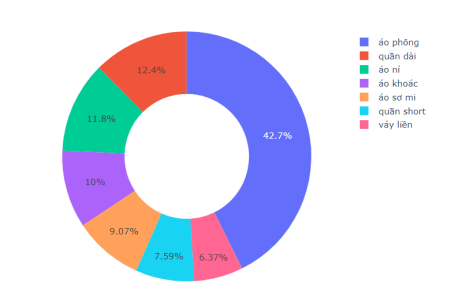
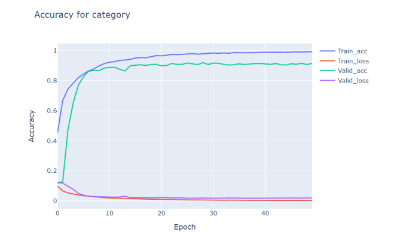
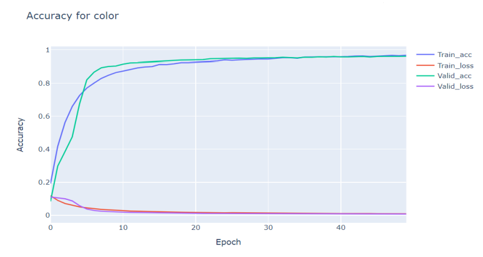

# Xây dựng mô hình đánh nhãn dữ liệu hình ảnh quần áo thời trang 

##  1. Tập dữ liệu 

Tập dữ liệu dùng để xây dựng mô hình cho hai tiêu chí (thể loại, màu  sắc) được thu thập độc lập với nhau. Trong đó có 10.678 hình ảnh dùng để phân loại quần áo theo thể loại và 15.741 hình ảnh cho dữ liệu phân loại màu sắc sản phẩm. 
Biểu đồ dưới đây sẽ thể hiện rõ tổng số lượng các mục trong tổng lượng dữ liệu thu thập.  

Tập dữ liệu được chia làm 3 phần: tập dữ liệu huấn luyện (64%), tập dữ liệu xác thực (16%), tập dữ liệu kiểm thử (20%).  
## 2. Xây dựng mô hình 

Xây dựng mô hình học máy 

| Tham số mạng neuron | Giá trị                  |
|---------------------|--------------------------|
| Số lớp ẩn           | 5                        |
| Tốc độ học          | 0.001                    |
| Epochs              | 50                       |
| Hàm mất mát         | Mean Squared Error (MSE) |

## 3. Đánh giá mô hình 

### 3.1. Phân loại theo thể loại
Độ chính xác, mất mát của tập huấn luyện và xác thực trong mô hình phân loại quần áo theo thể loại được biểu diễn bằng biểu đồ và bảng dưới đây:  

Chỉ số độ nhạy, độ hồi tưởng, f1-score của mô hình phân loại theo thể loại: 

|           | Độ nhạy                  | Độ hồi tưởng | F1-score |
|--------------|--------------------------|--------------|----------|
| Quần Dài     | 0.97 | 0.96 | 0.96 |
| Quần Short   | 0.93 | 0.91 | 0.92 |                    
| Váy Liền     | 0.76 | 0.66 | 0.71 |                     
| Áo Phông     | 0.95 | 0.98 | 0.96 |
| Áo Sơ Mi     | 0.91 | 0.85 | 0.88 |
| Áo Nỉ        | 0.85 | 0.82 | 0.83 |                    
| Áo Khoác     | 0.78 | 0.85 | 0.81 |                     
| accuracy     |      |      | 0.91 |
| macro avg    | 0.88 | 0.86 | 0.87 |
| weighted avg | 0.9 | 0.91 | 0.9 |

### 3.2. Phân loại theo màu sắc
Độ chính xác, mất mát của tập huấn luyện và xác thực trong mô hình phân loại quần áo theo màu sắc được biểu diễn bằng biểu đồ và bảng dưới đây:

Chỉ số độ nhạy, độ hồi tưởng, f1-score của mô hình phân loại theo màu sắc:

|           | Độ nhạy | Độ hồi tưởng | F1-score |
|--------------|---------|--------------|----------|
| Trắng        | 0.97    | 0.97         | 0.97     |
| Hồng         | 0.96    | 0.96         | 0.96     |                    
| Đỏ           | 0.96    | 0.67         | 0.96     |                     
| Vàng         | 0.98    | 0.99         | 0.98     |
| Xanh Dương   | 0.99    | 0.94         | 0.96     |
| Xám          | 0.94    | 0.93         | 0.94     |                    
| Đen          | 0.97    | 0.99         | 0.98     | 
| Xanh lá      | 0.99    | 0.95         | 0.97     | 
| accuracy     |         |              | 0.97     |
| macro avg    | 0.97    | 0.96         | 0.97     |
| weighted avg | 0.97    | 0.97         | 0.97     |

##  4. Nhận xét

Dựa vào các bảng biểu biểu đồ ta thấy độ chính xác của mô hình đạt kết quả tốt với bộ dữ liệu kiểm thử. Tuy nhiên số lượng dữ liệu vẫn còn tương đối ít, chưa thật sự đa dạng đáp ứng đầy đủ nhu cầu người dùng cần thu thập và tinh chỉnh mô hình để đạt kết quả với độ chính xác tốt hơn. 